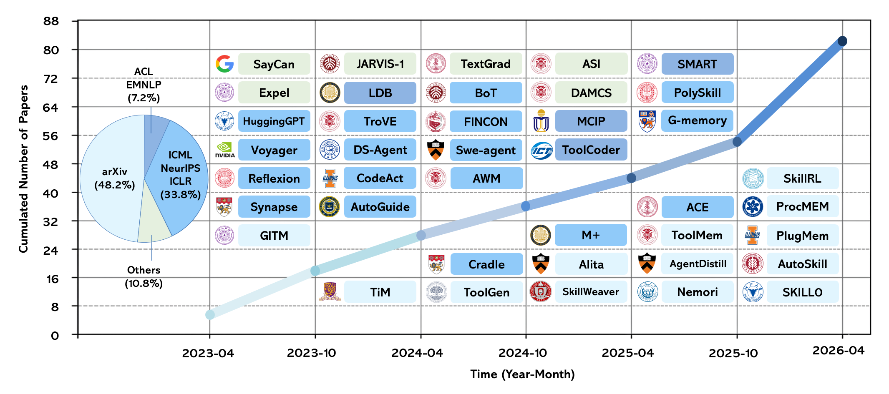
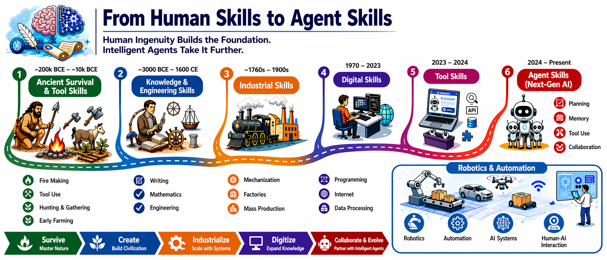
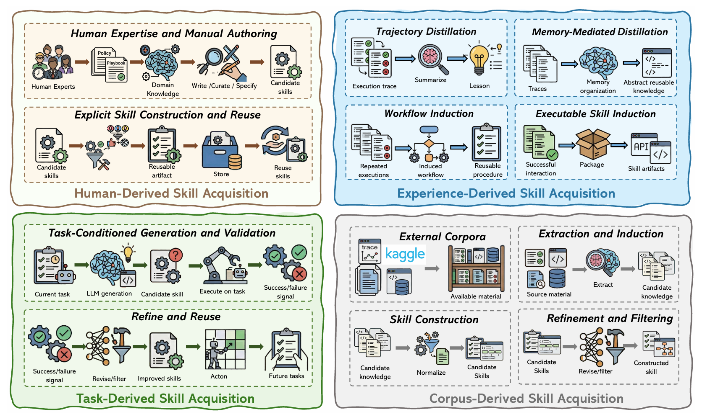
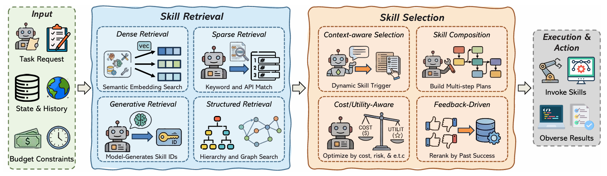
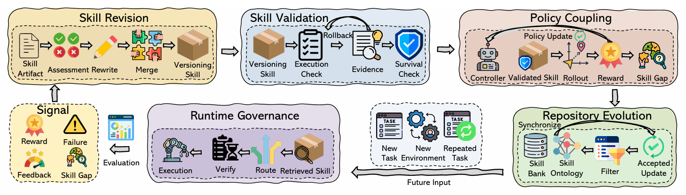
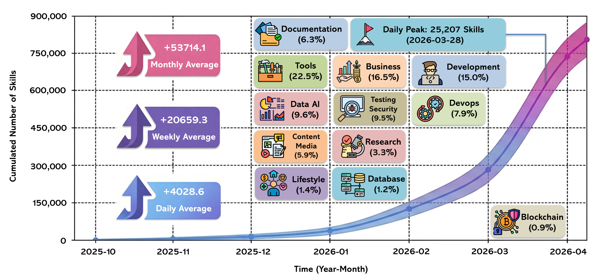
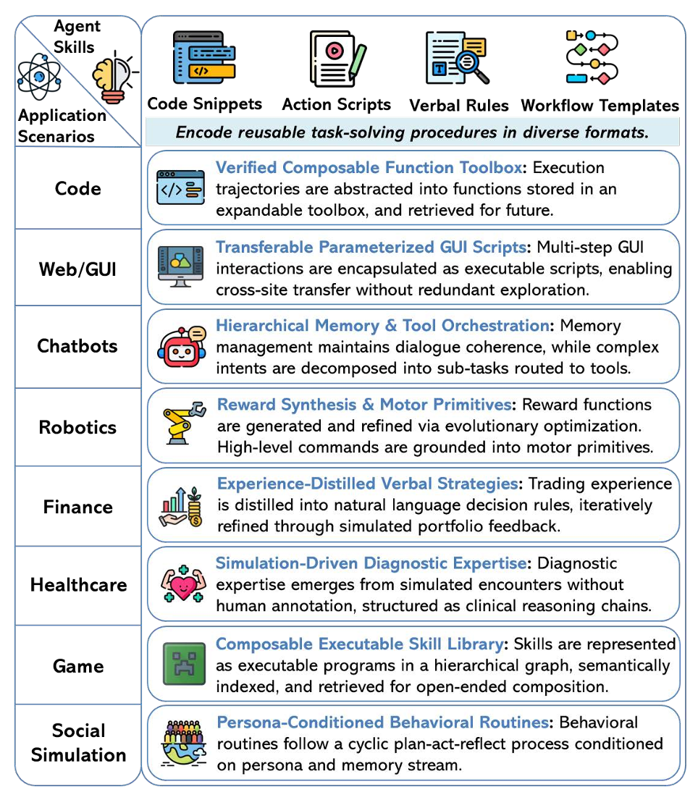

<h1 align="center">🌟 Awesome Agent Skills 🌟</h1>

<p align="center">
  <b>A curated paper list and resource hub for skill-centric LLM agent ecosystems.</b>
</p>
<p align="center">
  <a href="https://awesome.re"></a>
  <a href="https://arxiv.org/abs/2605.07358"></a>
  
  
</p>


<p align="center">
  <a href="#introduction">Introduction</a> ·
  <a href="#taxonomy">Taxonomy</a> ·
  <a href="#paper-list">Paper List</a> ·
  <a href="#benchmarks-and-evaluation">Benchmarks</a> ·
  <a href="#ecosystem-platforms-and-resources">Resources</a> ·
  <a href="#citation">Citation</a>
</p>

> [!NOTE]
> This repository accompanies our survey, **A Comprehensive Survey on Agent Skills: Taxonomy, Techniques, and Applications**.
>
> We collect papers, benchmarks, platforms, and ecosystem resources for understanding how reusable agent skills are represented, acquired, retrieved, selected, evolved, and governed.
>
> If this repository is useful for your work, please consider starring it and citing the survey.

```bibtex
@article{zhou2026comprehensive,
  title   = {A Comprehensive Survey on Agent Skills: Taxonomy, Techniques, and Applications},
  author  = {Zhou, Yingli and Wang, Shu and Su, Yaodong and Du, Wenchuan and Fang, Yixiang and Lin, Xuemin},
  journal = {arXiv preprint arXiv:2605.07358},
  year    = {2026}
}
```

<a id="contents"></a>

## 📚 Contents

- [🎯 Introduction](#introduction)
- [🧩 What Are Agent Skills?](#what-are-agent-skills)
- [🕰️ Historical Evolution of Skills](#historical-evolution-of-skills)
- [🗺️ Taxonomy](#taxonomy)
- [📄 Related Surveys](#related-surveys)
- [📑 Paper List](#paper-list)
  - [0. Foundations: Tools, Protocols, Retrieval, Memory](#0-foundations-tools-protocols-retrieval-memory)
  - [1. Skill Representation](#1-skill-representation)
  - [2. Skill Acquisition](#2-skill-acquisition)
  - [3. Skill Retrieval and Selection](#3-skill-retrieval-and-selection)
  - [4. Skill Evolution and Governance](#4-skill-evolution-and-governance)
- [🧪 Benchmarks and Evaluation](#benchmarks-and-evaluation)
- [🛠️ Ecosystem Platforms and Resources](#ecosystem-platforms-and-resources)
- [🚀 Application Scenarios](#application-scenarios)
- [💡 Research Opportunities](#research-opportunities)
- [🤝 Contributing](#contributing)
- [✍️ Citation](#citation)

<a id="introduction"></a>

## 🎯 Introduction

LLM-based agents are moving from passive response generation toward action-oriented task execution. They can call tools, retrieve memories, operate APIs, write code, and interact with external environments. However, tool access alone does not solve the harder procedural question: **when should a capability be invoked, how should multiple steps be coordinated, how should failures be handled, and how should outputs be validated?**

Our survey frames this bottleneck as the **procedural gap**. Agent skills address it by packaging reusable task-focused know-how into durable artifacts. Under this view, agents handle high-level intent interpretation, reasoning, and planning, while skills form the operational layer that makes execution reusable, inspectable, composable, and governable.

This repository tracks the emerging research landscape around agent skills, including:

- Representative papers across the agent-skill lifecycle.
- Benchmarks and evaluation protocols for skill-centric agents.
- Platforms and repositories for discovering, sharing, and governing skills.
- Application scenarios where reusable skills are becoming central to agent performance.

<p align="center">
  
  <br>
  <sub>Growth of representative research on agent skills from April 2023 to April 2026.</sub>
</p>

<a id="what-are-agent-skills"></a>

## 🧩 What Are Agent Skills?

In the survey, an **agent skill** is defined as a reusable procedural artifact with bounded scope. It externalizes task-focused know-how: not only what can be done, but also when to act, how to execute, what heuristics and failure modes matter, and how to judge completion.

Formally, a skill can be modeled as:

```text
S = (M, R, C)
```

| Component | Meaning | Examples |
|:--|:--|:--|
| `M` | Main instruction document | A `SKILL.md`, SOP, checklist, or workflow prompt |
| `R` | Auxiliary resources | References, templates, helper scripts, notebooks, schemas |
| `C` | Applicability conditions | Trigger descriptions, metadata, dependencies, embeddings |

Compared with raw tools, skills package the **how-to layer** around capability use. Compared with plain memory, skills are intended to be retrieved, executed, revised, and governed as reusable operational units.

<a id="historical-evolution-of-skills"></a>

## 🕰️ Historical Evolution of Skills

<p align="center">
  
</p>
<a id="taxonomy"></a>

## 🗺️ Taxonomy

We organize the literature around the **agent-skill lifecycle**, following the survey's taxonomy.

| Lifecycle Stage | Core Question | Representative Topics |
|:--|:--|:--|
| **Skill Representation** | How is procedural know-how packaged? | Text-backed skills, code-backed skills, hybrid skills |
| **Skill Acquisition** | Where do skills come from? | Human-derived, experience-derived, task-derived, corpus-derived acquisition |
| **Skill Retrieval & Selection** | How does an agent choose the right skill at the right time? | Dense/sparse retrieval, generative retrieval, hierarchy/graph retrieval, context-aware routing, composition |
| **Skill Evolution** | How do skills improve safely over time? | Revision, validation, policy coupling, repository evolution, trust, rollback, deprecation |

At a high level, skill-centric agent systems turn transient agent behavior into persistent capabilities:

```text
experience / expertise / corpus / task
        ↓
skill acquisition
        ↓
skill representation
        ↓
retrieval + selection
        ↓
execution
        ↓
feedback, validation, evolution, governance
```

<a id="related-surveys"></a>

## 📄 Related Surveys

- (TechRxiv 2026) *A Systematic Survey of Self-Evolving Agents: From Model-Centric to Environment-Driven Co-Evolution* [[Paper](https://www.techrxiv.org/doi/abs/10.36227/techrxiv.177203250.05832634/v2)]
- (arXiv 2026) *Externalization in LLM Agents: A Unified Review of Memory, Skills, Protocols and Harness Engineering* [[Paper](https://arxiv.org/abs/2604.08224)]
- (arXiv 2026) *SoK: Agentic Skills -- Beyond Tool Use in LLM Agents* [[Paper](https://arxiv.org/abs/2602.20867)]

<a id="paper-list"></a>

## 📑 Paper List

### 0. Foundations: Tools, Protocols, Retrieval, Memory

These works provide the infrastructure layer for agent skills: tool use, protocol-based capability access, retrieval, memory, and agentic execution loops.

- (NeurIPS 2023) *Toolformer* [[Paper](https://arxiv.org/abs/2302.04761)]
- (ICLR 2023) *ReAct* [[Paper](https://arxiv.org/abs/2210.03629)]
- (arXiv 2023) *HuggingGPT* [[Paper](https://arxiv.org/abs/2303.17580)]
- (arXiv 2023) *ToolLLM* [[Paper](https://arxiv.org/abs/2307.16789)]
- (Anthropic 2024) *Model Context Protocol (MCP)* [[Paper](https://www.anthropic.com/news/model-context-protocol)]
- (OpenAI 2023) *Function Calling* [[Paper](https://openai.com/blog/function-calling-and-other-api-updates)]
- (NeurIPS 2020) *RAG* [[Paper](https://arxiv.org/abs/2005.11401)]
- (EMNLP 2020) *DPR* [[Paper](https://aclanthology.org/2020.emnlp-main.550/)]
- (arXiv 2025) *In-depth Analysis of Graph-based RAG in a Unified Framework* [[Paper](https://arxiv.org/abs/2503.04338)]
- (arXiv 2025) *ArchRAG: Attributed Community-based Hierarchical Retrieval-Augmented Generation* [[Paper](https://arxiv.org/abs/2502.09891)]
- (arXiv 2025) *Clue-RAG* [[Paper](https://arxiv.org/abs/2507.08445)]
- (arXiv 2025) *BookRAG: A Hierarchical Structure-aware Index-based Approach for RAG on Complex Documents* [[Paper](https://arxiv.org/abs/2512.03413)]
- (arXiv 2025) *EraRAG* [[Paper](https://arxiv.org/abs/2506.20963)]
- (arXiv 2023) *MemGPT* [[Paper](https://arxiv.org/abs/2310.08560)]
- (arXiv 2023) *Think-in-Memory* [[Paper](https://arxiv.org/abs/2311.08719)]
- (arXiv 2026) *EverMemOS* [[Paper](https://arxiv.org/abs/2601.02163)]
- (arXiv 2026) *HyperMem* [[Paper](https://arxiv.org/abs/2604.08256)]
- (arXiv 2026) *MSA* [[Paper](https://arxiv.org/abs/2603.23516)]

### 1. Skill Representation

Skill representation studies how reusable procedural artifacts are packaged for agents to load, inspect, execute, and maintain.

#### Text-Based Skills

- (NeurIPS 2023) *Reflexion* [[Paper](https://arxiv.org/abs/2303.11366)]
- (AAAI 2024) *ExpeL* [[Paper](https://arxiv.org/abs/2308.10144)]
- (NeurIPS 2024) *Buffer of Thoughts* [[Paper](https://arxiv.org/abs/2406.04271)]
- (arXiv 2026) *Trace2Skill* [[Paper](https://arxiv.org/abs/2603.25158)]
- (arXiv 2026) *Ctx2Skill* [[Paper](https://arxiv.org/abs/2604.27660)] [[Code](https://github.com/S1s-Z/Ctx2Skill)]

#### Code-Backed Skills

- (NeurIPS 2023) *Voyager* [[Paper](https://arxiv.org/abs/2305.16291)]
- (arXiv 2026) *SkillCraft* [[Paper](https://arxiv.org/abs/2603.00718)]
- (ICLR 2026) *PolySkill* [[Paper](https://arxiv.org/abs/2510.15863)]
- (arXiv 2025) *Inducing Programmatic Skills for Agentic Tasks* [[Paper](https://arxiv.org/abs/2504.06821)]

#### Hybrid Skills

- (TPAMI 2025) *JARVIS-1* [[Paper](https://arxiv.org/abs/2311.05997)]
- (ICLR 2024) *Synapse* [[Paper](https://arxiv.org/abs/2306.07863)]
- (arXiv 2025) *SkillWeaver* [[Paper](https://arxiv.org/abs/2504.07079)]
- (arXiv 2026) *AgentSkillOS* [[Paper](https://arxiv.org/abs/2603.02176)]

### 2. Skill Acquisition

Skill acquisition studies how new skills are constructed from human expertise, agent experience, task demands, or external corpora.

<p align="center">
  
  <br>
  <sub>Overview of skill acquisition routes: human-derived, experience-derived, task-derived, and corpus-derived skills.</sub>
</p>

#### Human-Derived

- (arXiv 2026) *SkillNet* [[Paper](https://arxiv.org/abs/2603.04448)]
- (arXiv 2026) *AgentSkillOS* [[Paper](https://arxiv.org/abs/2603.02176)]
- (arXiv 2026) *SoK: Agentic Skills* [[Paper](https://arxiv.org/abs/2602.20867)]
- (arXiv 2024) *Agent Hospital* [[Paper](https://arxiv.org/abs/2405.02957)]

#### Experience-Derived

- (NeurIPS 2023) *Voyager* [[Paper](https://arxiv.org/abs/2305.16291)]
- (NeurIPS 2023) *Reflexion* [[Paper](https://arxiv.org/abs/2303.11366)]
- (AAAI 2024) *ExpeL* [[Paper](https://arxiv.org/abs/2308.10144)]
- (NeurIPS 2024) *Buffer of Thoughts* [[Paper](https://arxiv.org/abs/2406.04271)]
- (arXiv 2026) *Trace2Skill* [[Paper](https://arxiv.org/abs/2603.25158)]
- (ICML 2025) *Agent Workflow Memory* [[Paper](https://arxiv.org/abs/2409.07429)]
- (arXiv 2025) *AgentEvolver* [[Paper](https://arxiv.org/abs/2511.10395)]
- (arXiv 2025) *G-memory* [[Paper](https://arxiv.org/abs/2506.07398)]
- (arXiv 2025) *Nemori* [[Paper](https://arxiv.org/abs/2502.14828)]

#### Task-Derived

- (Findings EMNLP 2023) *CREATOR* [[Paper](https://aclanthology.org/2023.findings-emnlp.462/)]
- (ICLR 2024) *ToolMakers* [[Paper](https://arxiv.org/abs/2305.17126)]
- (arXiv 2024) *Cradle* [[Paper](https://arxiv.org/abs/2403.03186)]
- (arXiv 2024) *CodeAct* [[Paper](https://arxiv.org/abs/2402.01030)]

#### Corpus-Derived

- (arXiv 2023) *AppAgent* [[Paper](https://arxiv.org/abs/2312.13771)]
- (arXiv 2024) *AutoGuide* [[Paper](https://arxiv.org/abs/2403.08978)]
- (arXiv 2023) *HuggingGPT* [[Paper](https://arxiv.org/abs/2303.17580)]
- (arXiv 2023) *ToolLLM* [[Paper](https://arxiv.org/abs/2307.16789)]
- (arXiv 2024) *DS-Agent* [[Paper](https://arxiv.org/abs/2402.17453)]
- (arXiv 2026) *Ctx2Skill* [[Paper](https://arxiv.org/abs/2604.27660)] [[Code](https://github.com/S1s-Z/Ctx2Skill)]

### 3. Skill Retrieval and Selection

Skill retrieval and selection ask how agents surface the right skill from a growing library, then decide whether to invoke, compose, or revise that skill under the current task state and budget.

<p align="center">
  
  <br>
  <sub>Skill retrieval narrows the candidate space; skill selection decides what to execute, compose, or adapt.</sub>
</p>

#### Retrieval

- (ICLR 2025) *ToolGen: Unified Tool Retrieval and Calling via Generation* [[Paper](https://arxiv.org/abs/2410.03439)]
- (arXiv 2023) *ToolLLM* [[Paper](https://arxiv.org/abs/2307.16789)]
- (arXiv 2026) *SkillRL* [[Paper](https://arxiv.org/abs/2602.08234)]
- (arXiv 2026) *AgentSkillOS* [[Paper](https://arxiv.org/abs/2603.02176)]
- (arXiv 2026) *SkillNet* [[Paper](https://arxiv.org/abs/2603.04448)]
- (arXiv 2026) *GraphSkill* [[Paper](https://arxiv.org/abs/2603.06620)]

#### Selection and Routing

- (arXiv 2024) *AutoGuide* [[Paper](https://arxiv.org/abs/2403.08978)]
- (arXiv 2026) *MemSkill* [[Paper](https://arxiv.org/abs/2602.02474)]
- (arXiv 2026) *Memento-Skills* [[Paper](https://arxiv.org/abs/2603.18743)]
- (arXiv 2026) *SkillRouter* [[Paper](https://arxiv.org/abs/2603.22455)]
- (arXiv 2026) *GraSP* [[Paper](https://arxiv.org/abs/2604.17870)]
- (Findings ACL 2025) *ToolExpNet* [[Paper](https://aclanthology.org/2025.findings-acl.811/)]

### 4. Skill Evolution and Governance

Skill evolution studies how skills are revised, validated, optimized, synchronized, deprecated, and governed after deployment.

<p align="center">
  
  <br>
  <sub>Skill evolution turns feedback, failures, validation, and governance signals into safer reusable capabilities.</sub>
</p>

#### Skill Formation, Refinement, and RL Optimization

- (arXiv 2024) *TROVE* [[Paper](https://arxiv.org/abs/2401.12869)]
- (arXiv 2026) *Memento-Skills* [[Paper](https://arxiv.org/abs/2603.18743)]
- (arXiv 2026) *AutoSkill* [[Paper](https://arxiv.org/abs/2603.01145)]
- (arXiv 2026) *EvoSkill* [[Paper](https://arxiv.org/abs/2603.02766)]
- (arXiv 2026) *CoEvoSkills* [[Paper](https://arxiv.org/abs/2604.01687)]
- (arXiv 2026) *Ctx2Skill* [[Paper](https://arxiv.org/abs/2604.27660)] [[Code](https://github.com/S1s-Z/Ctx2Skill)]
- (arXiv 2026) *AutoRefine* [[Paper](https://arxiv.org/abs/2601.22758)]
- (arXiv 2026) *SkillRL* [[Paper](https://arxiv.org/abs/2602.08234)]
- (arXiv 2026) *Uni-Skill* [[Paper](https://arxiv.org/abs/2603.02623)]
- (arXiv 2026) *ARISE* [[Paper](https://arxiv.org/abs/2603.16060)]
- (arXiv 2025) *CASCADE* [[Paper](https://arxiv.org/abs/2512.23880)]

#### Memory-Centric and Runtime Re-entry

- (arXiv 2025) *ReasoningBank* [[Paper](https://arxiv.org/abs/2509.25140)]
- (arXiv 2026) *MemRL* [[Paper](https://arxiv.org/abs/2601.03192)]
- (arXiv 2026) *MemSkill* [[Paper](https://arxiv.org/abs/2602.02474)]
- (arXiv 2025) *MemEvolve* [[Paper](https://arxiv.org/abs/2512.18746)]

#### Governance, Trust, and Ecosystem Risk

- (arXiv 2026) *SkillRouter* [[Paper](https://arxiv.org/abs/2603.22455)]
- (arXiv 2026) *SkillNet* [[Paper](https://arxiv.org/abs/2603.04448)]
- (Preprints 2026) *SkillOS* [[Paper](https://www.preprints.org/manuscript/202602.1096/v1)]
- (arXiv 2025) *Audited Skill-Graph* [[Paper](https://arxiv.org/abs/2512.23760)]
- (Zenodo 2026) *PoisonedSkills* [[Paper](https://doi.org/10.5281/zenodo.19281322)]

<a id="benchmarks-and-evaluation"></a>

## 🧪 Benchmarks and Evaluation

Skill-centric evaluation should measure more than final task success. Important dimensions include retrieval quality, selection utility, execution robustness, cost, recovery, transfer, and long-term library health.

- *AgentBench* [[Paper](https://arxiv.org/abs/2308.03688)]
- *WebArena* [[Paper](https://arxiv.org/abs/2307.13854)]
- *TaskBench* [[Paper](https://arxiv.org/abs/2311.18760)]
- *STULIFE* [[Paper](https://arxiv.org/abs/2508.19005)]
- *TRACE* [[Paper](https://arxiv.org/abs/2510.00415)]
- *Evo-Memory* [[Paper](https://arxiv.org/abs/2511.20857)]
- *SkillsBench* [[Paper](https://arxiv.org/abs/2602.12670)]
- *SRA-Bench* [[Paper](https://arxiv.org/abs/2604.24594)] [[Code](https://github.com/oneal2000/SR-Agents)] [[Dataset](https://huggingface.co/datasets/WeihangSu/SRA-Bench)]

<a id="ecosystem-platforms-and-resources"></a>

## 🛠️ Ecosystem Platforms and Resources

<p align="center">
  
  <br>
  <sub>Growth of human-derived skills in emerging agent-skill platforms.</sub>
</p>

| Platform | Link | Focus |
|:--|:--|:--|
| **SkillNet** | https://skillnet.openkg.cn/ | Large-scale skill repository and organization |
| **ClawHub** | https://clawhub.ai/ | Agent skill sharing and discovery |
| **SkillHub** | https://www.skillhub.club/ | Community skill resources |
| **SkillsMP** | https://skillsmp.com/ | Marketplace-style skill ecosystem |
| **Skills.sh** | https://skills.sh/ | Agent skill publishing and reuse |

<a id="application-scenarios"></a>

## 🚀 Application Scenarios

<p align="center">
  
  <br>
  <sub>Representative application scenarios where agent skills act as reusable operational units.</sub>
</p>
<a id="research-opportunities"></a>

## 💡 Research Opportunities

The survey highlights several open directions for future agent-skill research:

- **Unified skill schema**: Common fields for scope, triggers, dependencies, versioning, resources, safety constraints, and provenance.
- **Resource-aware optimization**: Jointly optimize retrieval, planning, execution, latency, tool cost, and risk.
- **Library evolution under non-stationarity**: Handle API drift, changing task distributions, compatibility checks, rollback, and regression recovery.
- **Multimodal and domain-specific benchmarks**: Evaluate skills in embodied, GUI, robotics, autonomous driving, UAV, healthcare, finance, and other constrained settings.
- **Causality-driven skill diagnosis**: Attribute failures to retrieval mismatch, policy mis-selection, unsafe composition, stale dependencies, or tool malfunction.

<a id="contributing"></a>

## 🤝 Contributing

Contributions are welcome. If you want to add a paper, benchmark, project, or platform, please include:

1. Title
2. Venue and year
3. Link to paper, code, project, or website
4. Suggested category in this taxonomy

You can open an issue or submit a pull request directly.
